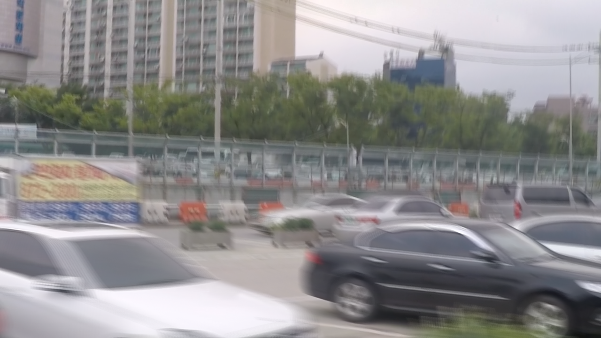
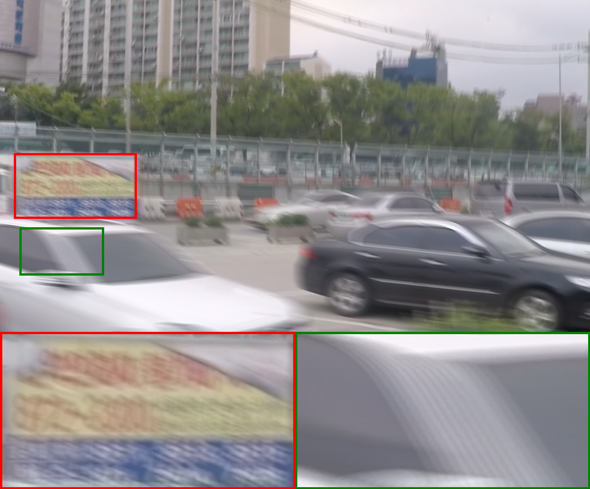

# README

## Intro

This is the collection of tools used to analysis for the image deblurring research. 

## Crop picture

Input

Output

## Tensor_analysis

This folder contains the tool used for analysis during training. I mainly use the PyTorch hook function to hook out the feature map and do analysis.

### Histogram analysis

Function: Hook out the tensor and draw the histogram.

### Feature visualization

Function: 

1. Hook out the tensor (feature map), and use the top-k or mean method to fuse the feature map. 
2. Visualize the fused feature map.

### Feature Fourier analysis

Function:

1. Hook out the tensor (feature map), and use the top-k or mean method to fuse the feature map.
2. Visualize the amplitude map of the feature map by Fourier transform.